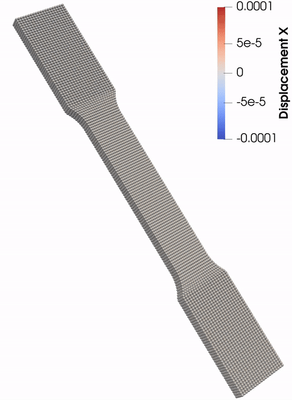
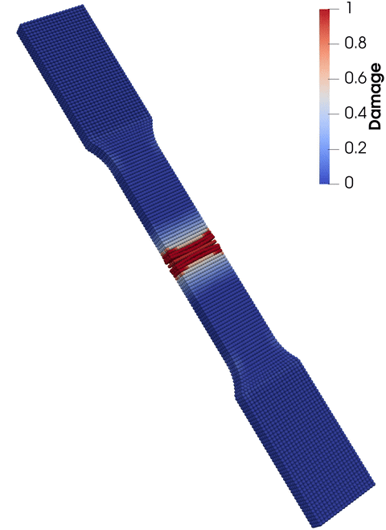

# Peridynamics.jl
A high-level Julia package for multithreaded peridynamics simulations

**Documentation:**\
[](https://kaipartmann.github.io/Peridynamics.jl/stable/)
[](https://kaipartmann.github.io/Peridynamics.jl/dev/)

**Build status:**\
[](https://github.com/kaipartmann/Peridynamics.jl/actions/workflows/CI.yml?query=branch%3Amain)
[](https://codecov.io/gh/kaipartmann/Peridynamics.jl)

**Code quality:**\
[](https://github.com/SciML/SciMLStyle)
[](https://github.com/JuliaTesting/Aqua.jl)

**Citation:**\
[](https://zenodo.org/badge/latestdoi/503281781)

## What is peridynamics?
Peridynamics is a non-local formulation of continuum mechanics where material points represent the continuum, and the relative displacements and forces are governed by an integro-differential equation that allows discontinuities. As a result, peridynamics is particularly well-suited for dynamic fracture simulations involving numerous cracks.

## Who can benefit from this package?
This package is designed for anyone interested in performing peridynamics simulations. While the current feature set provides a solid foundation, we are continuously working to enhance and expand the capabilities of `Peridynamics.jl`. We encourage you to open an issue or submit a pull request to share your feedback or contribute to making this package even more valuable to the community!

## Installation

To install `Peridynamics.jl`, follow these steps:

1. Install Julia from the [official Julia website](https://julialang.org/) if you haven't already.

2. Launch Julia and open the Julia REPL.

3. Enter the package manager by pressing `]` in the REPL.

4. In the package manager, type:
   ```
   add Peridynamics
   ```

5. Press `Backspace` or `Ctrl + C` to exit the package manager.

## Getting Started

We recommend looking at the [how-to guides](https://kaipartmann.github.io/Peridynamics.jl/stable/) and the [tutorials](https://kaipartmann.github.io/Peridynamics.jl/stable/) to start working with this package!

## Tutorials Overview

<style>
.tutorial-grid {
    display: grid;
    grid-template-columns: repeat(auto-fit, minmax(200px, 1fr));
    grid-gap: 20px;
    padding: 25px;
}

.tutorial-element {
    text-align: center;
    /* background-color: #f9f9f9; */
    background-color: rgb(240,240,240);;
    padding: 20px;
    border-radius: 10px;
    box-shadow: 0 4px 8px rgba(0, 0, 0, 0.1);
    transition: transform 0.3s, box-shadow 0.3s;
}

.tutorial-element:hover {
    transform: scale(1.05);
    box-shadow: 0 8px 16px rgba(0, 0, 0, 0.2);
}

.tutorial-element img {
    width: 100%;
    max-width: 300px;
    height: auto;
    border-radius: 10px;
    margin-bottom: 10px;
}

.tutorial-element a {
    color: #333;
    text-decoration: none;
    font-weight: bold;
}

.tutorial-element a:hover {
    color: #007bff;
}
</style>

<div class="tutorial-grid">

<div class="tutorial-element">
<a href="link_to_your_documentation#tutorial_tension_static">Tensile test quasi-static</a><br>
<a href="link_to_your_documentation#tutorial_tension_static">
    
</a>
</div>

<div class="tutorial-element">
<a href="link_to_your_documentation#tutorial_tension_dynfrac">Tensile test dynamic</a><br>
<a href="link_to_your_documentation#tutorial_tension_dynfrac">
    
</a>
</div>

<div class="tutorial-element">
<a href="link_to_your_documentation#tutorial_tension_precrack">Tension with predefined crack</a><br>
<a href="link_to_your_documentation#tutorial_tension_precrack">
    
</a>
</div>

<div class="tutorial-element">
<a href="link_to_your_documentation#tutorial_logo">Peridynamics.jl logo</a><br>
<a href="link_to_your_documentation#tutorial_logo">
    
</a>
</div>

</div>


## Authors

- <a href="https://orcid.org/0000-0002-5238-4355">Kai Partmann (University of Siegen) </a>
- <a href="https://orcid.org/0009-0004-9195-0112">Manuel Dienst (University of Siegen) </a>
- <a href="https://orcid.org/0000-0002-2213-8401">Kerstin Weinberg (University of Siegen) </a>

## Acknowledgement


The authors gratefully acknowledge the support of the Deutsche Forschungsgemeinschaft (DFG) under the project WE2525-14/1.

The authors gratefully acknowledge the computing time provided to them on the high-performance computer Noctua 2 at the NHR Center PC2. These are funded by the Federal Ministry of Education and Research and the state governments participating on the basis of the resolutions of the GWK for the national highperformance computing at universities (www.nhr-verein.de/unsere-partner).
