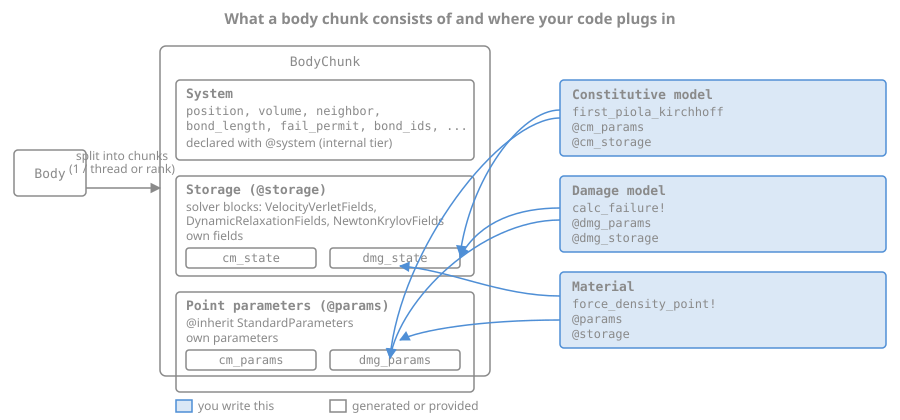
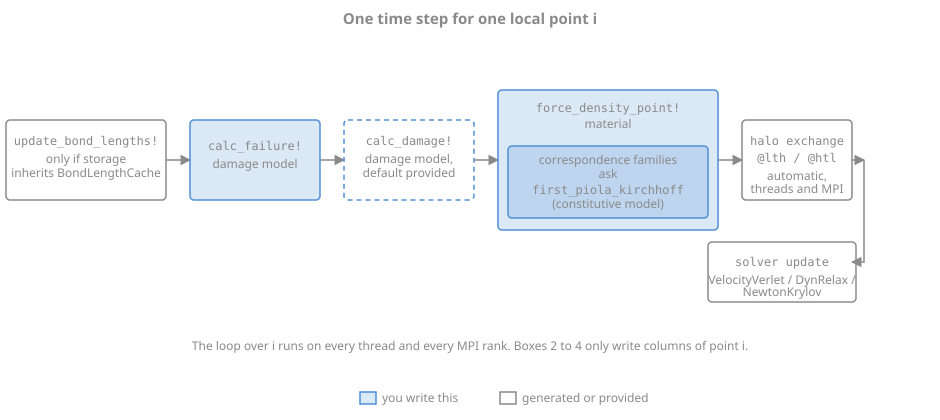

# Extending Peridynamics.jl

This is the index of the developer documentation. Every row of the table below points at
one lookup page with a contract table and a skeleton, and at the tutorial that writes the
same thing in full.

## What do you want to write?

| I want to ... | read | tutorial | key names |
|:---|:---|:---|:---|
| a material with its own force law | [Materials](@ref) | [Writing your own material](@ref tutorial_custom_material) | `AbstractBondSystemMaterial`, `@params`, `@storage`, `force_density_point!` |
| a damage model: a failure criterion, with a state of its own | [Damage models](@ref) | [Writing your own damage model](@ref tutorial_custom_damage_model) | `AbstractDamageModel`, `calc_failure!`, `@dmg_params`, `@dmg_storage` |
| a constitutive model: a stress-strain relation, plasticity | [Constitutive models](@ref) | [Writing your own constitutive model](@ref tutorial_custom_constitutive_model) | `AbstractConstitutiveModel`, `first_piola_kirchhoff`, `@cm_params`, `@cm_storage` |
| material parameters of my own as [`material!`](@ref) keywords | [Point parameters](@ref) | [Writing your own material](@ref tutorial_custom_material) | `@params`, `@kwarg`, `@derived`, `@log`, `@inherit` |
| storage fields of my own | [Storages](@ref) | [Writing your own material](@ref tutorial_custom_material) | `@storage`, the field shapes, `init_field` |
| to export a field of my own | [Storages](@ref) | [Writing your own damage model](@ref tutorial_custom_damage_model) | `custom_field`, `export_field` |
| to reuse the fields or parameters of a shipped material | [Blocks you can inherit](@ref) | [Writing your own material](@ref tutorial_custom_material) | `@inherit`, `block_table` |
| a new system, the discretization itself | [Systems](@ref), internal tier | none | `@system`, `system_type`, `SystemSizes` |
| a new time solver | [Time solvers](@ref), internal tier | none | `AbstractTimeSolver`, `solve!`, `register_solver!` |

## Where your code plugs in



A body chunk carries a system, a storage and the point parameters, and the material, the
constitutive model and the damage model are the three boxes you can replace.



One time step for one local point, from the bond length cache to the solver update, with
the halo exchange in between.

## How the names are built

A name you have not seen yet still tells you what it does.

| form | meaning | examples |
|:---|:---|:---|
| `get_*` | reads or resolves a quantity from a container, which may mean computing it on the spot | `get_params`, `get_neighbor`, `get_vector_diff`, `get_frac_params` |
| `each_*_idx` | returns what a loop iterates over | `each_point_idx`, `each_bond_idx` |
| `update_*!` | writes in place | `update_vector!`, `update_add_vector!`, `update_bond_lengths!` |
| a bare noun | a physical quantity computed on the spot, or a question asked of a material or a model | `kernel`, `current_bond_length`, `bond_stretch`, `damage_state`, `storage_type` |

## The three API tiers

| tier | what it promises |
|:---|:---|
| **User API**, everything the package exports | Stable. A change is breaking and is listed in `NEWS.md`. Listed on [Public API](@ref). |
| **Extension API**, everything declared `public` | Stable within a minor release. A rename is breaking and is listed in `NEWS.md`. Listed on [Extension API](@ref). |
| **Internal**, everything else | Nothing. It can change in any release without notice. Systems and time solvers are here. |

See [API stability](@ref) for what is deliberately left out of the extension API and how to
query the tier of a name.

## How to write the names

The extension API is not exported, so a name is either written out in full,

```julia
Peridynamics.force_density_point!
```

or imported explicitly, which reads better in a longer file:

```julia
using Peridynamics: BondSystem, each_bond_idx, get_vector_diff, update_add_vector!
```

See also [Materials](@ref), [Point parameters](@ref), [Storages](@ref),
[Damage models](@ref), [Constitutive models](@ref), [Blocks you can inherit](@ref),
[Extension API](@ref).
