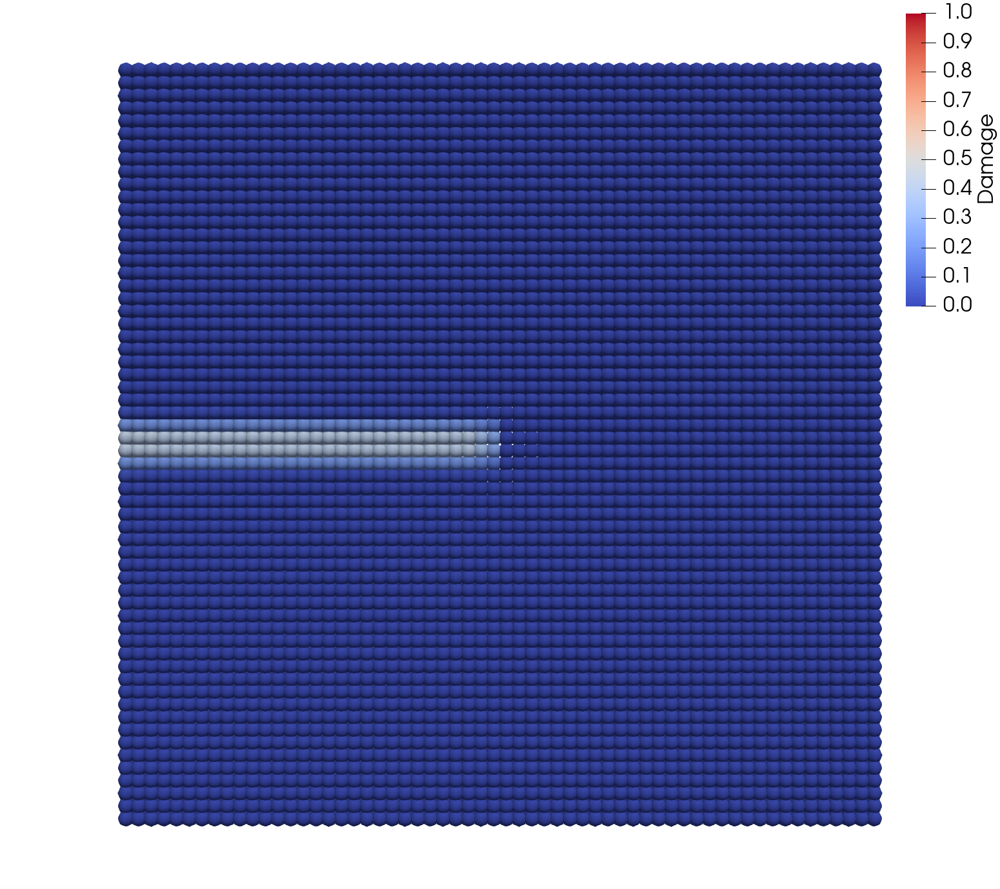

# [CrackedPlateUnderTension.jl](@id cracked-plate-under-tension)

The complete script for this tutorial can be found here: [CrackedPlateUnderTension.jl](https://github.com/ kaipartmann/Peridynamics.jl/blob/main/examples/CrackedPlateUnderTension.jl).

First, we have to load the `Peridynamics.jl` package.

```julia
using Peridynamics
```

Now whe have the exported types and methods available in the namespace.
This allows us to construct a `PointCloud` by specifying the dimensions and the point spacing $\Delta x$.

```julia
length_x = 0.05 # [m]
length_y = 0.05 # [m]
length_z = 0.005 # [m]
Δx = length_y / 60 # point spacing: 60 points along y-describe_interactions
pc = PointCloud(length_x, length_y, length_z, Δx)
```

As next step, we define the material with the parameters `horizon` (horizon $\delta$ in peridynamics theory), density `rho`, youngs modulus `E` and critical energy release rate `Gc`.

```julia
mat = BondBasedMaterial(;
    horizon = 3.015Δx, # [m]
    rho = 7850.0, # [kg/m^3]
    E = 210e9, # [N/m^2]
    Gc = 1000.0, # [N/m]
)
```

Now we want the plate to have a crack from the left side to the middle.
Therefore we need to specify a [`PreCrack`](@ref) object.
A `PreCrack` is simply two `Vector{Int}`'s containing point indices.
Points in `point_id_set_a` don't interact with points in  `point_id_set_b`.
So we need to specify all points above and below the crack, as seen in the following image:

```@raw html

```
(Visualization made with [ParaView](https://www.paraview.org))

```julia
cracklength = 0.5 * length_x
precrack_set_a = findall(
    (pc.position[2, :] .>= 0) .&
    (pc.position[2, :] .< 12 * Δx) .&
    (pc.position[1, :] .<= -length_x / 2 + cracklength),
)
precrack_set_b = findall(
    (pc.position[2, :] .<= 0) .&
    (pc.position[2, :] .> -12 * Δx) .&
    (pc.position[1, :] .<= -length_x / 2 + cracklength),
)
precracks = [PreCrack(precrack_set_a, precrack_set_b)]
```

The `PreCrack` is then wrapped inside a `Vector` because `PDSingleBodyAnalysis` needs a `Vector{PreCrack}` in case you have multiple predefined cracks in your model.

Now we specify boundary conditions, so the crack has to grow under the load applied to the plate.
Therefore, we want the five rows of points in the upper and lower part of the plate to have a constant velocity of $0.1\,\frac{\mathrm{m}}{\mathrm{s}}$ in the positive and negative $y$-direction to pull the plate apart.

```julia
bc_set_top = findall(pc.position[2,:] .> length_y / 2 - 5.1 * Δx)
bc_set_bottom = findall(pc.position[2,:] .< -length_y / 2 + 5.1 * Δx)
bc_top = VelocityBC(t -> 0.1, bc_set_top, 2)
bc_bottom = VelocityBC(t -> -0.1, bc_set_bottom, 2)
boundary_conditions = [bc_top, bc_bottom]
```

Now we specify the temporal discretization.
Our simulation should run for 2000 time steps and the stable time step should be calculated.

```julia
td = TimeDiscretization(2000)
```

To save the results, we specify with `ExportSettings` that every 10 timesteps, the results should be saved to a folder named `results/CrackedPlateUnderTension`.

```julia
simulation_name = "CrackedPlateUnderTension"
resfolder = joinpath(@__DIR__, "results", simulation_name)
mkpath(resfolder)
es = ExportSettings(resfolder, 10)
```

Now everything needed for the `PDSingleBodyAnalysis` is defined.

```julia
job = PDSingleBodyAnalysis(
    name = simulation_name,
    pc = pc,
    mat = mat,
    precracks = precracks,
    bcs = boundary_conditions,
    td = td,
    es = es,
)
```
```julia
results = submit(job);
```

##### Results after 2000 timesteps:
```@raw html

```
(Visualization made with [ParaView](https://www.paraview.org))
