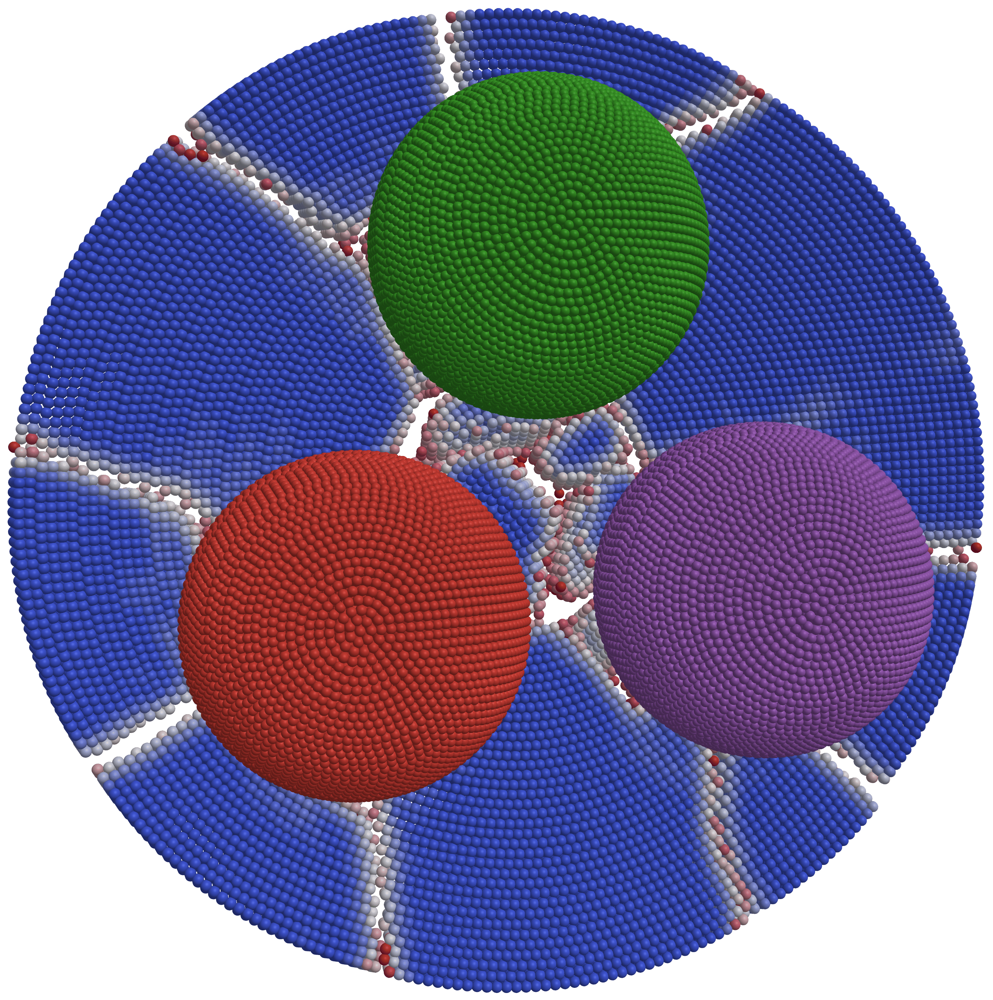

```@raw html

```
[Download video](https://github.com/kfrb/Peridynamics.jl/blob/main/docs/src/assets/logo.mp4)

(Visualization made with [ParaView](https://www.paraview.org))

# [Logo.jl](@id logo)

The Julia logo crashing into a plate and braking it into many pieces.
The complete script for this tutorial can be found here: [Logo.jl](https://github.com/kfrb/Peridynamics.jl/blob/main/examples/Logo.jl).

First, we have to load the `Peridynamics.jl` package.

```julia
using Peridynamics
```
Now we create the plate in the background by specifying the dimensions and the point spacing.
```julia
# PLATE - INDEX: p
dimXYₚ = 0.1 # [m]
dimZₚ = 0.01 # [m]
Δxₚ = dimXYₚ/50 # [m]
pcₚ = PointCloud(dimXYₚ, dimXYₚ, dimZₚ, Δxₚ)
```
A cubic point cloud is assembled, and only the points inside a specified radius are preserved to create the spheres of the logo.
These points are then copied three times and moved to the correct position to represent the logo.
```julia
# SPHERES OF LOGO - INDEX: s
Øₛ = 0.03 # [m]
Vₛ = 4 / 3 * π * (Øₛ / 2)^3 # [m³]
Δxₛ = Øₛ / 20 # [m]
pcₛ₀ = PointCloud(Øₛ, Øₛ, Øₛ, Δxₛ)
sphere_point_set = @views findall(
    sqrt.(
        pcₛ₀.position[1, :] .^ 2 + pcₛ₀.position[2, :] .^ 2 + pcₛ₀.position[3, :] .^ 2
    ) .<= Øₛ / 2,
)
pcₛ₀.position[3, sphere_point_set] .+= Øₛ / 2 + dimZₚ / 2 + 1.1Δxₚ
pcₛ₁ = PointCloud(pcₛ₀.position[:, sphere_point_set], pcₛ₀.volume[sphere_point_set])
pcₛ₂ = deepcopy(pcₛ₁)
pcₛ₃ = deepcopy(pcₛ₁)
rₗ = Øₛ / 2 + 0.2 * Øₛ
pcₛ₁.position[2, :] .+= rₗ
pcₛ₂.position[1, :] .+= rₗ * cos(30π / 180)
pcₛ₂.position[2, :] .-= rₗ * sin(30π / 180)
pcₛ₃.position[1, :] .-= rₗ * cos(30π / 180)
pcₛ₃.position[2, :] .-= rₗ * sin(30π / 180)
```
Different material properties are used for the plate and the spheres.
##### Plate
- Horizon $\delta = 3.015 \Delta x_p$
- Density $\rho = 2000\,\mathrm{kg}\,\mathrm{m}^{-3}$
- Youngs modulus $E = 30 \times 10^9 \, \mathrm{Pa}$
- Griffith's parameter $G_c = 10 \, \mathrm{N} \, \mathrm{m}^{-1}$
##### Julia-logo spheres
- Horizon $\delta = 3.015 \Delta x_s$
- Density $\rho = 7850\,\mathrm{kg}\,\mathrm{m}^{-3}$
- Youngs modulus $E = 210 \times 10^9 \, \mathrm{Pa}$
- Griffith's parameter $G_c = 1000 \, \mathrm{N} \, \mathrm{m}^{-1}$
```julia
matₚ = BondBasedMaterial(;
    horizon=3.015Δxₚ,
    rho=2000.0,
    E=30e9,
    Gc=10.0,
)
matₛ = BondBasedMaterial(;
    horizon=3.015Δxₛ,
    rho=7850.0,
    E=210e9,
    Gc=1000.0,
)
```

All material points of the spheres have a initial velocity of $-20\, \mathrm{m} \, \mathrm{s}^{-1}$ in $z$-direction.
```julia
icₛ = [VelocityIC(-20.0, 1:pcₛ₁.n_points, 3)]
```
For the contact analysis, every body needs to be specified with a [`BodySetup`](@ref).
Time can be saved by using only one sphere for the calculation of the stable time step.
```julia
plate = BodySetup(pcₚ, matₚ)
sphere1 = BodySetup(pcₛ₁, matₛ; ics=icₛ)
sphere2 = BodySetup(pcₛ₂, matₛ; ics=icₛ, calc_timestep=false)
sphere3 = BodySetup(pcₛ₃, matₛ; ics=icₛ, calc_timestep=false)
body_setup = [plate, sphere1, sphere2, sphere3]
```
Contact between the plate and the three spheres needs to be specified.
```julia
contact = [Contact((1, 2), Δxₚ), Contact((1, 3), Δxₚ), Contact((1, 4), Δxₚ)]
```
For this simulation, 3000 time steps with explicit time integration and the velocity verlet algorithm are used.
```julia
td = TimeDiscretization(3000)
```
Now we give the simulation a name and create a directory for the results. 
```julia
simulation_name = "Logo"
resfolder = joinpath(@__DIR__, "results", simulation_name)
mkpath(resfolder)
es = ExportSettings(resfolder, 10)
```
To complete everything, the [`PDContactAnalysis`](@ref) is created and submitted for simulation.
```julia
job = PDContactAnalysis(;
    name=simulation_name, body_setup=body_setup, contact=contact, td=td, es=es
)
```
```julia
results = submit(job);
```
